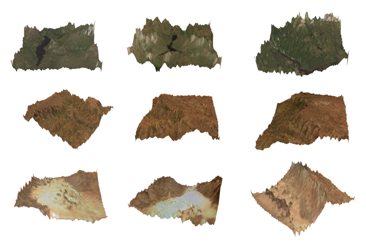
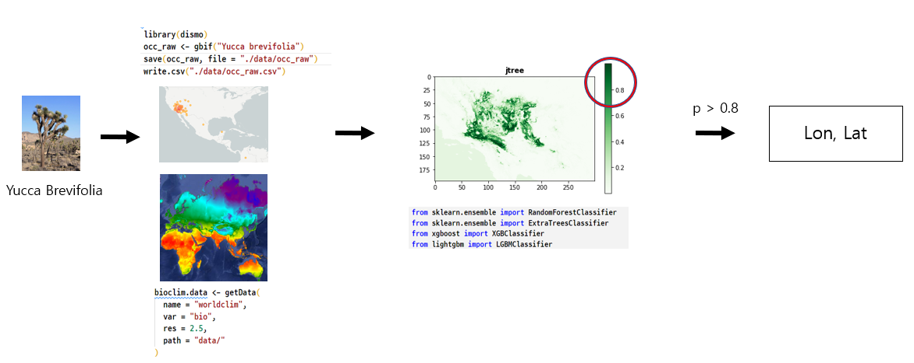
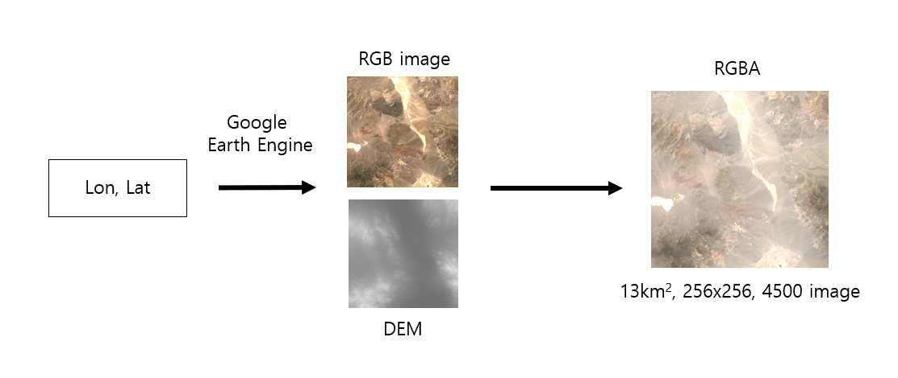
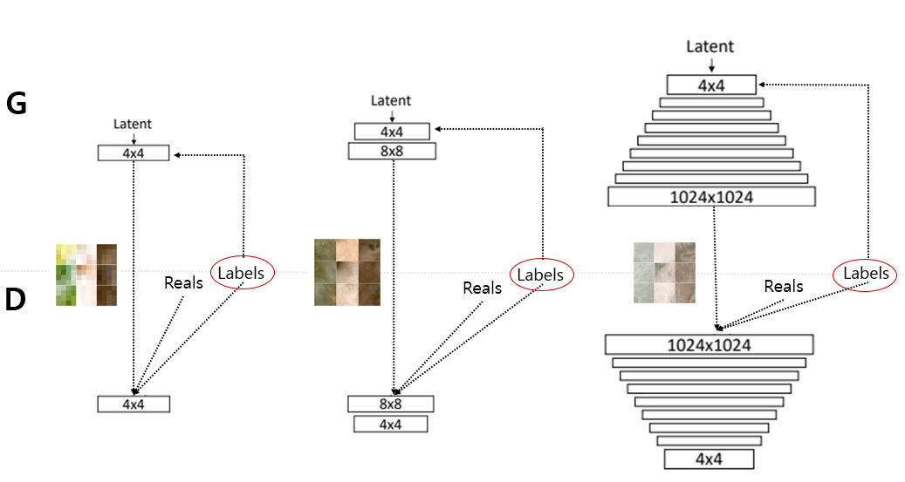
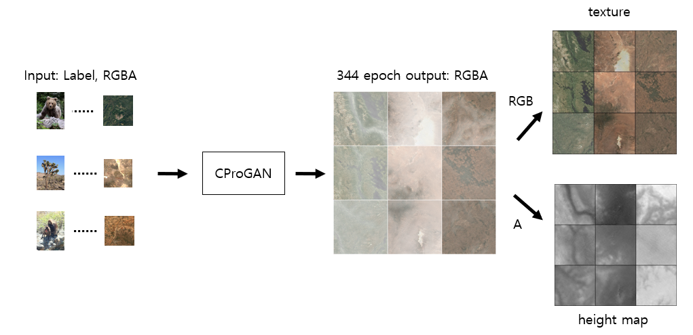

# **Procedural3DTerrain**(+ eco)

Generate terrain with GANs by labeling SDM.

-   This is a fork of [this repo](https://github.com/Panagiotou/Procedural3DTerrain).

    -   Added: Conditional proGANs
    -   Changed: Input Channel(RGB to RGBA, rgb: sat, a: dem)
    

## **Environment(not updated)**

-   Python 3.10

    -   sdm.yaml (data_processing)
    -   torch.yaml (models)
        -   pytorch version: conda installtorch torchvision torchaudio cudatoolkit=11.3 -c pytorch
    -   google earth engine

-   R 4.2
    -   dismo

## **Dataset**

-   **GBIF**

    -   Theropithecus gelada: GBIF.org (16 July 2022) GBIF Occurrence Download https://doi.org/10.15468/dl.hdta26
    -   Ursus arctos Linnaeus: GBIF.org (08 July 2022) GBIF Occurrence Download https://doi.org/10.15468/dl.gw69aj
    -   Yucca brevifolia: GBIF.org (16 July 2022) GBIF Occurrence Download https://doi.org/10.15468/dl.gsdsnm

-   **Worldclim 2.5m** (about 4.5 km)
-   **Google Earth Engine**: for DEM, sat RGB Image (256x256, $13km^2$)

## **Model**

-   Added a label to [an existing repo](https://github.com/Panagiotou/Procedural3DTerrain). The discriminant and loss function were implemented, so I used them.

## **Result**

viewer: https://github.com/Nor-s/Pixel3D/tree/heightmap

## **References**

-   SDM(species distribution model)

    -   https://github.com/daniel-furman/Python-species-distribution-modeling
    -   https://blog.daum.net/geoscience/1714
    -   https://github.com/shandongfx/workshop_maxent_R/blob/master/code/Appendix1_case_study.md
    -   http://spatialecology.weebly.com/r-code--data/49
    -   https://scikit-learn.org/stable/auto_examples/applications/plot_species_distribution_modeling.html

-   GANs
    -   https://arxiv.org/abs/1411.1784
    -   https://github.com/aladdinpersson/Machine-Learning-Collection
    -   https://kr.mathworks.com/help/deeplearning/ug/train-conditional-generative-adversarial-network.html
    -   https://blog.paperspace.com/conditional-generative-adversarial-networks/
    -   https://github.com/christopher-beckham/gan-heightmaps
